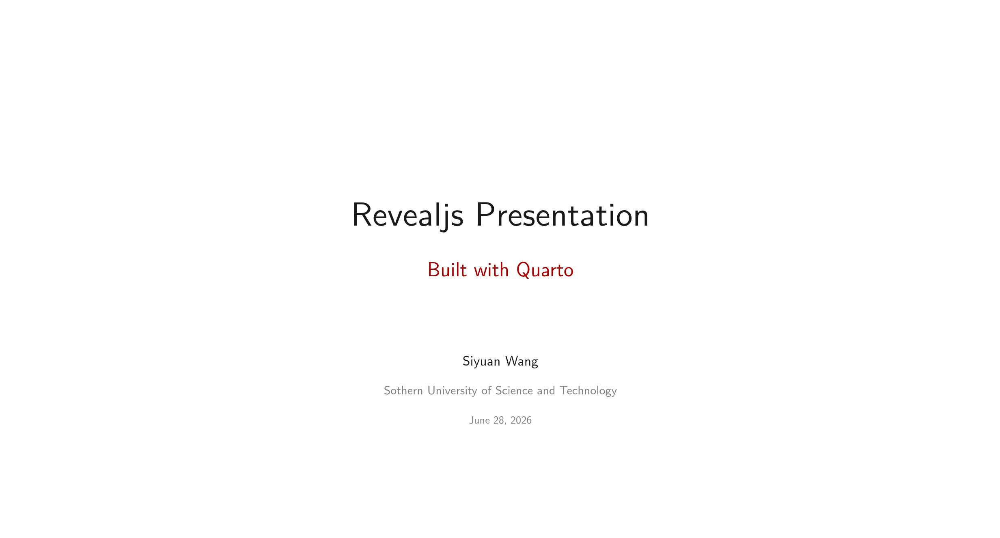
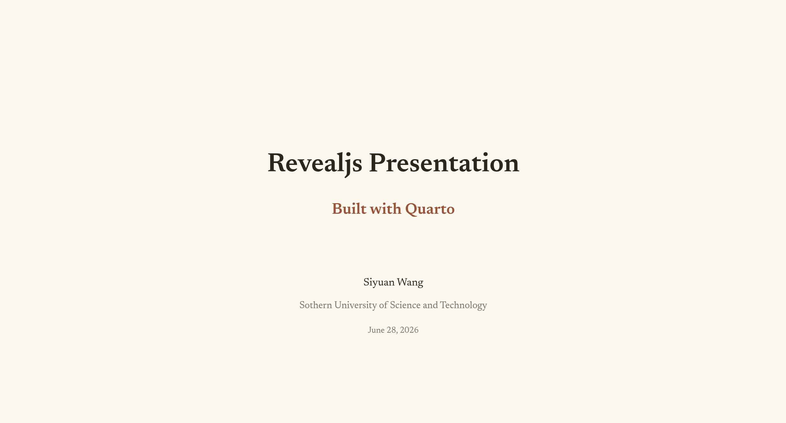
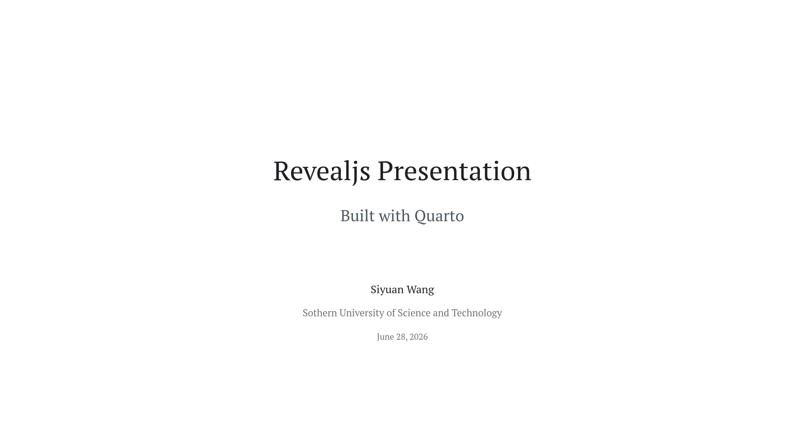
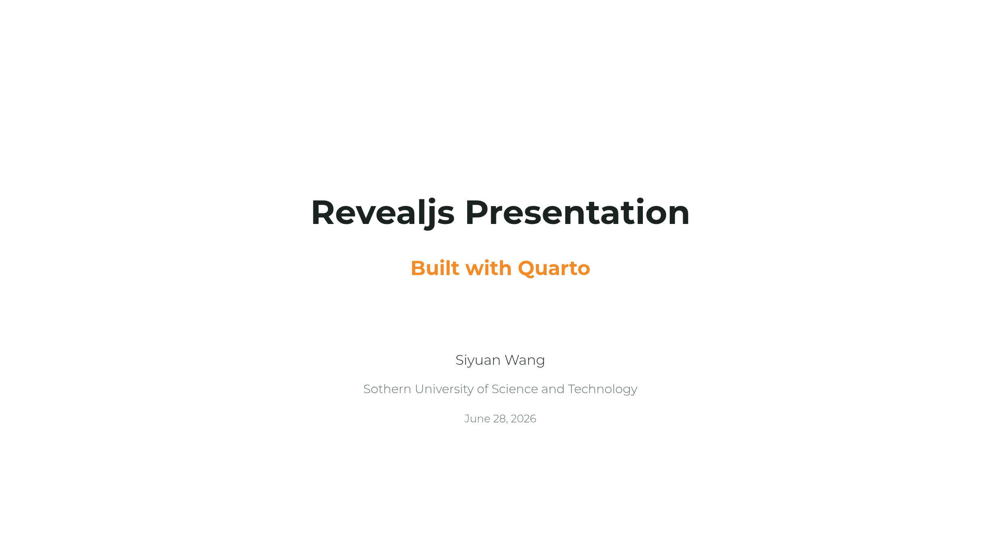

<p align="center">
    <h2 align="center"> Quarto Template
    </h2>
</p>

<p align="center" style="text-decoration: none; border: none; margin-bottom: 10px;">
    
    
</p>


<br>


## :cherry_blossom: Introduction

- This repo hosts my [Quarto](https://neovim.io/) `revealjs` template for presentation. 
- **Check the template configured for documentation (`html` and `pdf`) at [here](https://github.com/syw-robotics/quarto_template/tree/doc).** 
- [**Click to preview this template**](https://syw-robotics.github.io/quarto_template/main.html)

## :potted_plant: Features
- `main.qmd` is the only file that needs to edit.
- Resources are stored in `assets` folder.
- Add bibliography in `assets/references.bib` file.

## :page_with_curl: Scripts

- `clear.sh`:
    - clear exported files. 
- `preview.sh`
    - preview rendered html.
- `export_pdf.sh`
    - render the Quarto `revealjs` deck and export a selectable-text PDF through the same Revealjs print view used by the HTML output.
    - requires `quarto`, `node`, and a Chrome/Chromium-compatible browser in `PATH`.
    - usage: `./export_pdf.sh` or `./export_pdf.sh your-slide.qmd`.
    - if the browser is not auto-detected, set it explicitly: `CHROME_BIN=microsoft-edge ./export_pdf.sh`.
    - the PDF exporter implementation lives in `assets/export_reveal_pdf.mjs`; the project root keeps only the `export_pdf.sh` entry script.
    - the exporter preserves internal cross-reference links, selectable text, custom footers, Revealjs slide numbers, and expands tabsets so each tab is included in the PDF.
- `export_portable_html.sh`
    - bundles the selected English + Chinese fonts from `assets/fonts/` into `exported_html/assets/fonts/`.
    - all fonts are self-contained — no dependency on locally installed fonts or internet access.
    - run it after `quarto render` to make the HTML portable to any machine.
    - `export_pdf.sh` runs this step automatically after rendering.
    - to present offline, copy the rendered `.html` file together with its matching `*_files` directory and any project assets you reference, such as `assets/`.

## Theme config

- `assets/themes/default.scss` is the default theme entry.
- More theme details are available in [`assets/themes/README.md`](assets/themes/README.md).
- Theme entries are in `assets/themes/`:
    - `assets/themes/default.scss`
    - `assets/themes/claude.scss`
    - `assets/themes/sustech.scss`
    - `assets/themes/minimal.scss`


| Theme | Preview | Fonts | Character |
| --- | --- | --- | --- |
| `default.scss` |  | Latin Modern Sans + LXGW WenKai | Clean default academic style with red accents and bracket footnotes. |
| `claude.scss` |  | Newsreader + Source Han Sans SC | Warm style inspired by Claude/Anthropic colors, with serif Latin typography and soft rust accents. |
| `minimal.scss` |  | PT Serif + Noto Sans CJK SC | Neutral compact style for dense technical presentations. |
| `sustech.scss` |  | Montserrat + Noto Sans CJK SC | SUSTech university style with green and orange accents. |


- To switch themes, change the Revealjs theme entry in your `.qmd` file:

    ```yaml
    format:
      revealjs:
        theme: assets/themes/claude.scss
    ```

- Theme font selection is controlled at the top of each theme entry:
    ```scss
    $theme-font-en: "Latin Modern Sans";
    $theme-font-cn: "LXGW WenKai";
    ```
    The theme imports the matching local font CSS automatically.

- Slide footnote markers created with `^[...]` use superscript by default.

    To change them globally, set:
    ```scss
    $theme-footnote-mode: "sup"; // sup, bracket, badge, hidden
    ```

    To change one slide only, add `{.footnote-bracket}`, `{.footnote-badge}`, or `{.footnote-hidden}` to that slide header.

    e.g.
    ```markdown
    ## Slide Title {.footnote-bracket}
    ```
